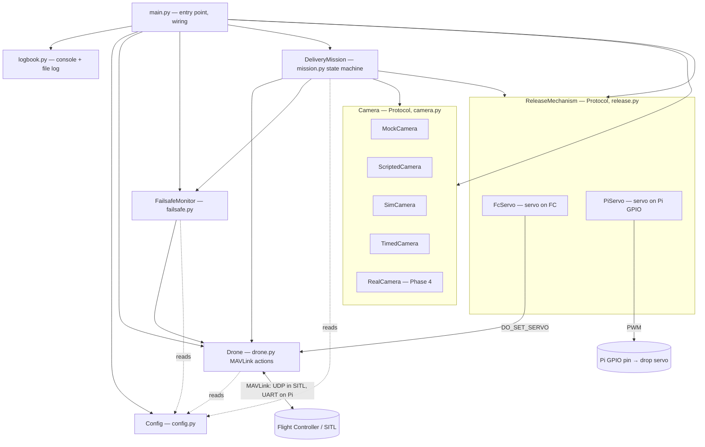
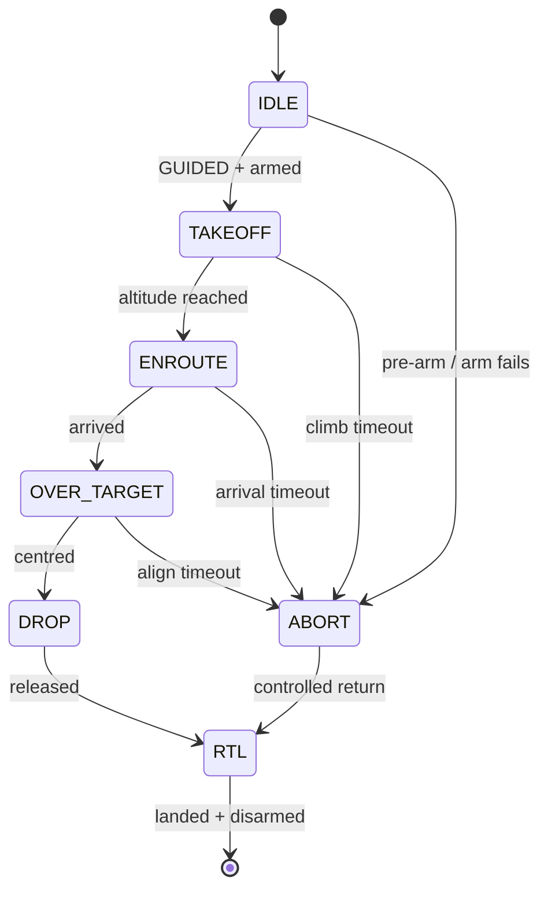
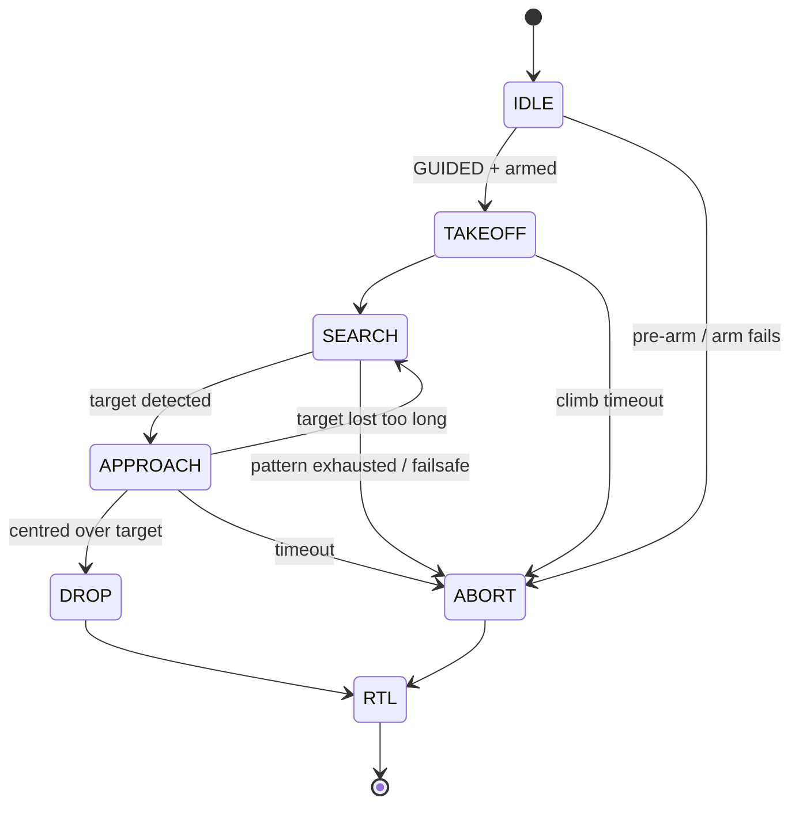
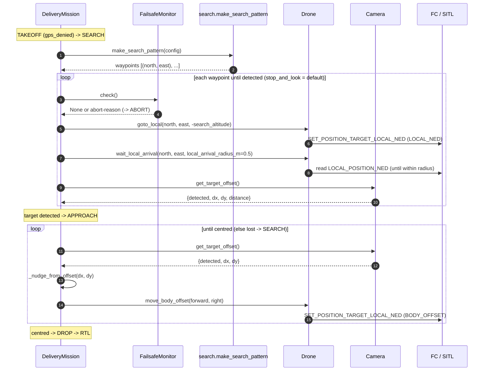

# Architecture & Flow

How the companion-computer code fits together: the components, how they relate, and
the end-to-end mission flow. See also [SIM_TO_REAL.md](SIM_TO_REAL.md) for the
simulation→hardware transition and [ROADMAP.md](ROADMAP.md) for the phased plan.

## Design rule

> **Only `config.py` knows whether SITL or a real flight controller is on the other
> end.** Everything else — `drone.py`, `mission.py`, `failsafe.py`, `camera.py` — is
> identical in both worlds. That is what makes the move to real hardware a small step.

## Components and their relationships



| Component | Responsibility |
|-----------|----------------|
| `main.py` | Chooses the `Config`, sets up logging, wires the objects, starts the mission. The single line that differs SITL vs Pi lives here. |
| `Config` | All parameters + the `connection_string`. `Config.sitl()` vs `Config.pi_serial()`. |
| `Drone` | Wraps the MAVLink link. Low-level actions: heartbeat, telemetry, set EKF origin, mode/arm/takeoff/goto/goto_local/RTL, body-frame nudges, FC servo helpers. Hardware-agnostic. |
| `Camera` | A `Protocol` returning `{detected, dx, dy, distance}`. `MockCamera`/`ScriptedCamera`/`SimCamera`/`TimedCamera` now; `RealCamera` (AI camera) later — same contract, so the mission never changes. Chosen by `config.camera_source`. |
| `ReleaseMechanism` | A `Protocol` (`setup/reset/drop/confirm`) for the payload drop. `FcServo` drives a servo on an FC output over MAVLink (SITL); `PiServo` drives a servo on a Pi GPIO pin directly. Chosen by `config.release_mechanism` — the mission never changes. |
| `FailsafeMonitor` | Companion-side safety: link loss, telemetry loss, battery, phase timeout. Returns a reason string; the mission decides to ABORT. |
| `DeliveryMission` | The state machine that sequences the delivery and runs the failsafe check before each state. |
| `logbook` | Configures logging to console + a timestamped file under `logs/`. |

## Coordinate frames: lat/lon vs NED

The drone can be told *where to go* in three different frames. Knowing which is which
explains why `Drone` has more than one navigation method:

| Frame | What it is | Units | Origin | Used by |
|-------|-----------|-------|--------|---------|
| **Global (lat/lon)** | Geographic latitude/longitude + altitude — absolute position on Earth, from GPS | degrees | the Earth | `Drone.goto()` (outdoor / GPS) |
| **Local NED** | North-East-Down grid relative to the launch point (EKF origin) | metres | launch point | `Drone.goto_local()` (indoor search waypoints) |
| **Body-offset NED** | Forward-Right-Down relative to the drone's *current* position & heading | metres | the drone itself | `Drone.move_body_offset()` (visual nudges) |

- **lat/lon** = *where on Earth* (e.g. `-35.3627, 149.1652`). Needs GPS → outdoor only.
- **Local NED** = *how many metres from the launch point* (e.g. north 2 m, east 1 m).
  `down` is positive downward, so 2 m altitude = `down = -2`. This is how indoor search
  navigates without GPS — the position estimate comes from optical flow.
- **Body-offset NED** = *how many metres from where I am now* (forward / right). This is
  what the approach loop uses to say "0.3 m forward, 0.2 m right" toward the target.

So: search uses **absolute** local-NED targets (`goto_local`), the fine approach uses
**relative** body-offset nudges (`move_body_offset`), and the GPS path uses **global**
lat/lon (`goto`).

## Mission flow (GPS / outdoor — Phase 1)



- **Failsafe before every state:** the loop calls `FailsafeMonitor.check()` before
  each state (except while already aborting/landing). It can return `LINK_LOSS`,
  `NO_TELEMETRY`, `LOW_BATTERY` or `TIMEOUT_<phase>` → the machine jumps to `ABORT`.
- **`OVER_TARGET` is the visual-servoing loop:** read the camera's `dx/dy`, nudge the
  drone in the body frame (`Drone.move_body_offset()`), repeat until centred, then
  `DROP`. With `MockCamera` (dx=dy=0) the first frame is already centred; with
  `ScriptedCamera` you can watch it correct over several steps.

## Mission flow (indoor / GPS-denied — Phase 2)

The hall delivery has no known target position, so the machine takes a search path
when `config.gps_denied` is true (the default). Implemented in Phase 2:



- **`SEARCH`** (`mission._search`) flies a pattern in local NED — an expanding spiral by
  default (`search.py`) — and polls the camera at each waypoint (`stop_and_look`,
  default) or while flying (`continuous`). On detection → `APPROACH`; if the whole
  pattern is exhausted without a hit → `ABORT` (reason `TARGET_NOT_FOUND`).
- **`APPROACH`** (`mission._approach`) does visual servoing: it nudges the drone in the
  body frame from the camera's `dx/dy` until centred, then `DROP`. If the target is lost
  for too many frames in a row it falls back to `SEARCH`.
- The indoor path goes **`APPROACH → DROP` directly**; `OVER_TARGET` is the GPS path's
  fine-centring state. The `Camera` contract is unchanged, so Phase 4 only swaps the
  detector (`SimCamera` → `RealCamera`).

## Call sequence 1 — GPS / outdoor (Phase 1, WITH GPS)

The **GPS path** (`config.gps_denied = False`) at the level of **which method of which
class calls which method**, with the key parameters. It mirrors the code in `main.py`
and `mission.py`; each `->>FC` is a MAVLink message to the flight controller. Sequence 2
below shows the indoor / no-GPS path and what changes.

```mermaid
sequenceDiagram
    autonumber
    participant Main as main.py
    participant Mis as DeliveryMission
    participant FS as FailsafeMonitor
    participant Dr as Drone
    participant Cam as Camera
    participant Rel as ReleaseMechanism
    participant FC as FC / SITL

    Main->>Dr: Drone(config).connect()
    Dr->>FC: wait_heartbeat()
    Dr->>FC: request_data_streams(rate_hz=4)
    Main->>Mis: DeliveryMission(drone, camera, failsafe, config, release).run()

    note over Mis,FS: before EVERY state
    Mis->>FS: check()
    FS->>Dr: link_alive(heartbeat_timeout_s=3.0)
    Dr->>FC: read HEARTBEAT (within timeout?)
    FS->>Dr: get_battery()
    Dr->>FC: read SYS_STATUS
    FS-->>Mis: None or "LINK_LOSS"/"NO_TELEMETRY"/"LOW_BATTERY"/"TIMEOUT_x"

    note over Mis: IDLE
    Mis->>FS: setup_geofence()
    FS->>Dr: set_param("FENCE_TYPE", 1)
    Dr->>FC: PARAM_SET FENCE_TYPE=1
    FS->>Dr: set_param("FENCE_ALT_MAX", fence_alt_max_m)
    Dr->>FC: PARAM_SET FENCE_ALT_MAX
    FS->>Dr: set_param("FENCE_ENABLE", 1)
    Dr->>FC: PARAM_SET FENCE_ENABLE=1
    Mis->>Rel: setup()  (FcServo)
    Rel->>Dr: configure_drop_servo()
    Dr->>FC: PARAM_SET SERVO9_FUNCTION=0
    Mis->>Rel: reset()
    Rel->>Dr: reset_servo() → MAV_CMD_DO_SET_SERVO(9, neutral_pwm)
    Mis->>Dr: wait_ready_to_arm(require_abs=True)
    Dr->>FC: read EKF_STATUS_REPORT until EKF_POS_HORIZ_ABS
    Mis->>Dr: set_mode("GUIDED")
    Dr->>FC: SET_MODE GUIDED
    Mis->>Dr: arm()
    Dr->>FC: MAV_CMD_COMPONENT_ARM_DISARM(1)

    note over Mis: TAKEOFF
    Mis->>Dr: takeoff(config.cruise_alt=10.0)
    Dr->>FC: MAV_CMD_NAV_TAKEOFF

    note over Mis: ENROUTE
    Mis->>Dr: goto(target_lat, target_lon, cruise_alt)
    Dr->>FC: SET_POSITION_TARGET_GLOBAL_INT
    Mis->>Dr: wait_arrival(lat, lon, arrival_radius_m=1.5)
    Dr->>FC: read GLOBAL_POSITION_INT (until within radius)

    note over Mis: OVER_TARGET (loop until centred)
    Mis->>Cam: get_target_offset()
    Cam-->>Mis: {detected, dx, dy, distance}
    Mis->>Mis: _nudge_from_offset(dx, dy)
    Mis->>Dr: move_body_offset(forward, right)
    Dr->>FC: SET_POSITION_TARGET_LOCAL_NED (BODY_OFFSET)

    note over Mis: DROP (release_mechanism="fc"; "pi" drives a Pi GPIO instead)
    Mis->>Rel: drop()
    Rel->>Dr: drop() → MAV_CMD_DO_SET_SERVO(9, drop_pwm=1900)
    Mis->>Rel: confirm()
    Rel->>Dr: read_servo(expected=drop_pwm) → read SERVO_OUTPUT_RAW
    Mis->>Rel: reset()
    Rel->>Dr: reset_servo() → MAV_CMD_DO_SET_SERVO(9, neutral_pwm)

    note over Mis: RTL
    Mis->>Dr: return_to_launch()
    Dr->>FC: SET_MODE RTL
    Mis->>Dr: wait_disarmed(phase_timeout_s=60.0)
    Dr->>FC: read HEARTBEAT (until disarmed)
```

> Parameters shown are the defaults from `config.py`. On an abort the flow jumps from
> the current state straight to `ABORT → RTL` (the `_rtl` calls above), skipping the
> remaining steps.
>
> **Convention:** each `Dr->>FC` is a method's *primary* MAVLink interaction — a command
> for the "doers" (`takeoff`, `goto`, `arm`, `set_mode`, `drop`, …) or a read for the
> "waiters/getters" (`get_battery`, `read_servo`, `wait_arrival`, `wait_disarmed`,
> `link_alive`). Secondary confirmation reads (command ACKs, the altitude poll inside
> `takeoff`, the armed-state poll inside `arm`) are omitted for clarity.

## Call sequence 2 — indoor / GPS-denied (Phase 2, NO GPS)

The **indoor path** (`config.gps_denied = True`, the default) at method level. Same
machine, same components, same `Camera` interface as sequence 1 — only the navigation
differs.

**Unchanged from sequence 1:** `connect()` / heartbeat, the failsafe `check()` before
every state, the rest of IDLE (geofence, release `setup()`/`reset()`, GUIDED, arm),
TAKEOFF, and the final DROP → RTL block — the mission calls are identical, so they are not
redrawn below. (IDLE also gains the optional `set_origin()` — see the Changed table.)

> The drop still goes through the `ReleaseMechanism` protocol, but on the **real indoor
> build** `config.release_mechanism = "pi"`, so `PiServo` drives the servo on a Pi GPIO
> pin (PWM from the Pi) instead of `FcServo`'s `DO_SET_SERVO` to the FC. The mission code
> is the same; only the wired implementation differs.

**Changed from sequence 1:**

| Step | Sequence 1 (GPS) | Sequence 2 (no GPS) |
|------|------------------|----------------------|
| Pre-flight (IDLE) | — | (optional) `set_origin()` → `SET_GPS_GLOBAL_ORIGIN` when `set_origin_on_start`, since there is no GPS to seed the EKF origin/home |
| Pre-arm | `wait_ready_to_arm()` → `EKF_POS_HORIZ_ABS` | `wait_ready_to_arm(require_abs=False)` → `EKF_POS_HORIZ_REL` |
| Go to target | `ENROUTE`: `goto(lat, lon)` (global) | `SEARCH`: `make_search_pattern` + `goto_local(north, east)` (local NED) + camera polling |
| Centre & drop | `OVER_TARGET`: `move_body_offset` until centred | `APPROACH`: same `move_body_offset`, but falls back to `SEARCH` if the target is lost |

The diagram below shows only the **changed** part (SEARCH + APPROACH); `make_search_pattern`
builds the waypoints and the camera here is `SimCamera` (later `RealCamera`). It shows the
default `stop_and_look` cadence; `continuous` instead polls the camera while flying each
leg (`_poll_until_arrival_or_detection`). Because SEARCH is long-running, it re-checks the
failsafe on **every leg** (in addition to the per-state check from `run()`).



