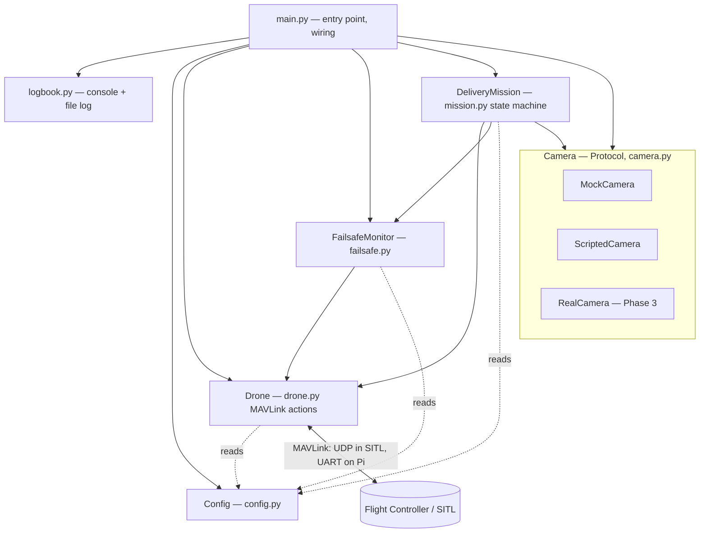
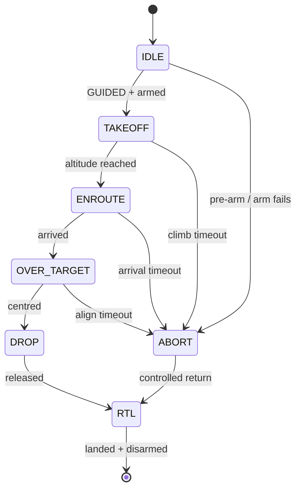
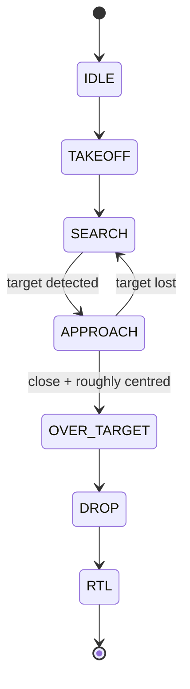
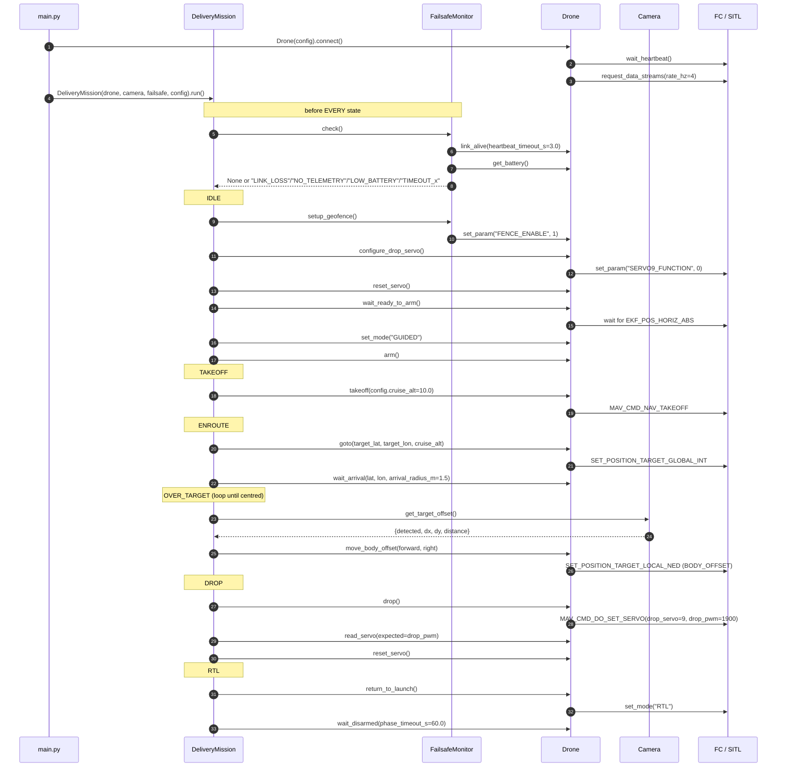

# Architecture & Flow

How the companion-computer code fits together: the components, how they relate, and
the end-to-end mission flow. See also [SIM_TO_REAL.md](SIM_TO_REAL.md) for the
simulation→hardware transition and [ROADMAP.md](ROADMAP.md) for the phased plan.

## Design rule

> **Only `config.py` knows whether SITL or a real flight controller is on the other
> end.** Everything else — `drone.py`, `mission.py`, `failsafe.py`, `camera.py` — is
> identical in both worlds. That is what makes the move to real hardware a small step.

## Components and their relationships

| Component | Responsibility |
|-----------|----------------|
| `main.py` | Chooses the `Config`, sets up logging, wires the objects, starts the mission. The single line that differs SITL vs Pi lives here. |
| `Config` | All parameters + the `connection_string`. `Config.sitl()` vs `Config.pi_serial()`. |
| `Drone` | Wraps the MAVLink link. Low-level actions: heartbeat, telemetry, mode/arm/takeoff/goto/RTL, body-frame nudges, servo drop. Hardware-agnostic. |
| `Camera` | A `Protocol` returning `{detected, dx, dy, distance}`. `MockCamera`/`ScriptedCamera` now; `RealCamera` (AI camera) later — same contract, so the mission never changes. |
| `FailsafeMonitor` | Companion-side safety: link loss, telemetry loss, battery, phase timeout. Returns a reason string; the mission decides to ABORT. |
| `DeliveryMission` | The state machine that sequences the delivery and runs the failsafe check before each state. |
| `logbook` | Configures logging to console + a timestamped file under `logs/`. |

## Mission flow (current — Phase 1)

- **Failsafe before every state:** the loop calls `FailsafeMonitor.check()` before
  each state (except while already aborting/landing). It can return `LINK_LOSS`,
  `NO_TELEMETRY`, `LOW_BATTERY` or `TIMEOUT_<phase>` → the machine jumps to `ABORT`.
- **`OVER_TARGET` is the visual-servoing loop:** read the camera's `dx/dy`, nudge the
  drone in the body frame (`Drone.move_body_offset()`), repeat until centred, then
  `DROP`. With `MockCamera` (dx=dy=0) the first frame is already centred; with
  `ScriptedCamera` you can watch it correct over several steps.

## Mission flow (planned — Phase 2, indoor + search)

The hall delivery has no known target position, so the machine grows a search stage
(see [ROADMAP.md](ROADMAP.md)):

`SEARCH` flies a pattern in local NED (expanding spiral by default) and polls the
camera; `APPROACH` does visual servoing toward a detected target. The `Camera`
contract is unchanged, so only the detector is swapped (`RealCamera`).

## Call sequence — who calls what (Phase 1 happy path)

This is the same flow as above, but at the level of **which method of which class
calls which method**, with the key parameters. It mirrors the code in `main.py` and
`mission.py`; each `->>FC` is a MAVLink message to the flight controller.

> Parameters shown are the defaults from `config.py`. On an abort the flow jumps from
> the current state straight to `ABORT → RTL` (the `_rtl` calls above), skipping the
> remaining steps.

