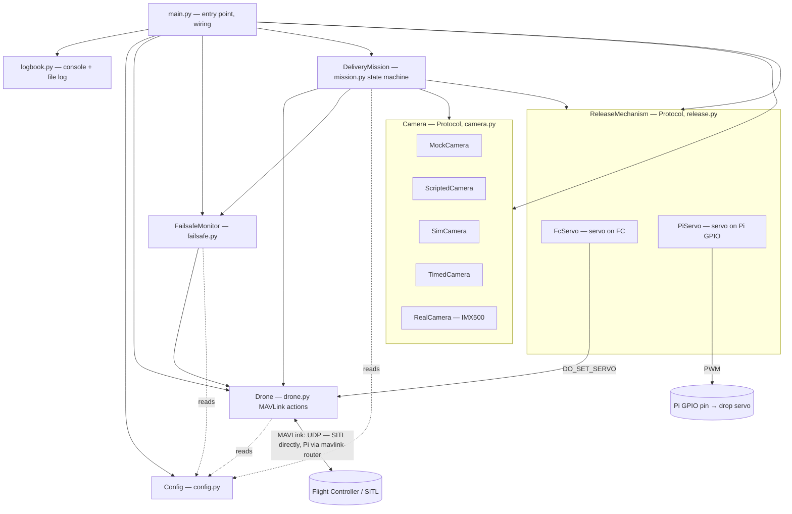
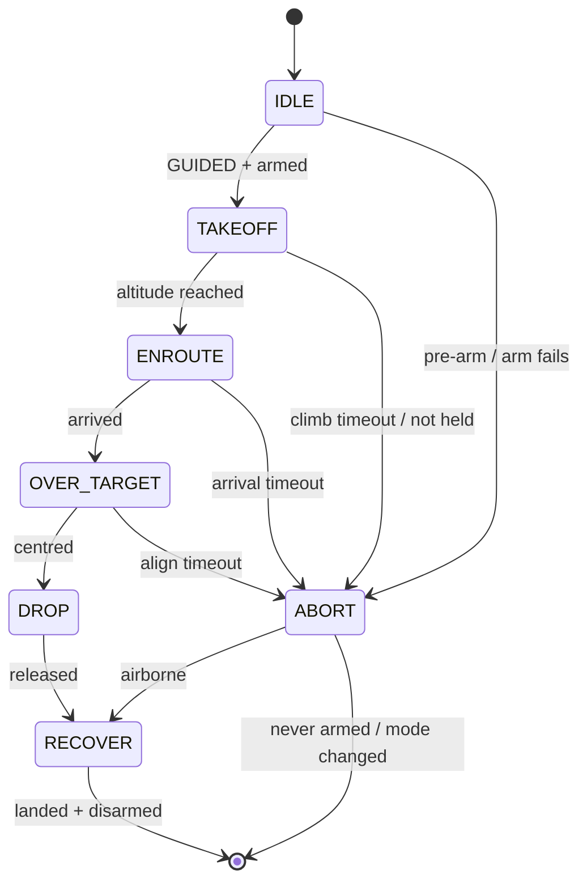
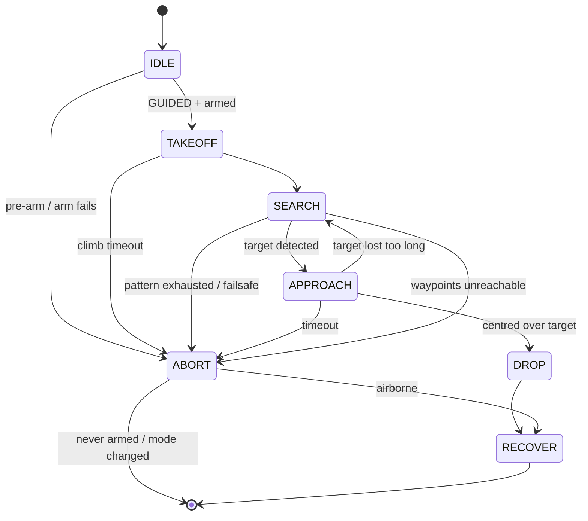
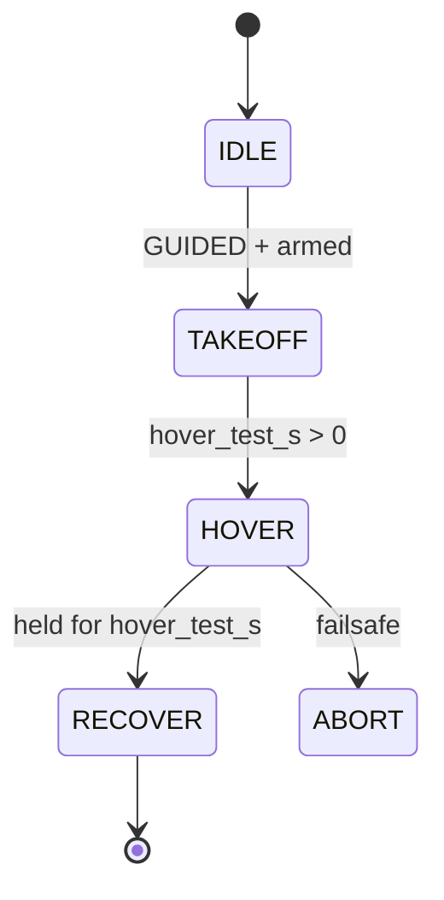
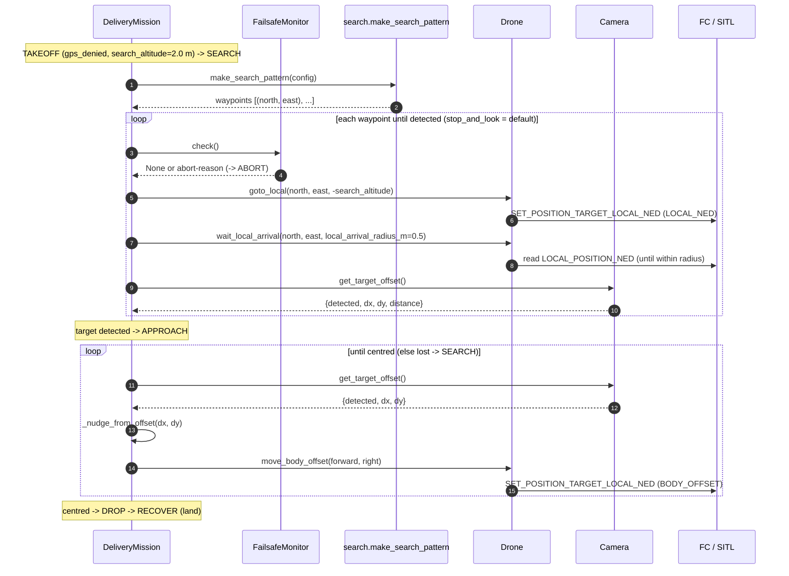

# Architecture & Flow

How the companion-computer code fits together: the components, how they relate, and
the end-to-end mission flow. See also [SIM_TO_REAL.md](SIM_TO_REAL.md) for the
simulation→hardware transition and [ROADMAP.md](ROADMAP.md) for the phased plan.

## Design rule

> **Only `config.py` knows whether SITL or a real flight controller is on the other
> end.** Everything else — `drone.py`, `mission.py`, `failsafe.py`, `camera.py` — is
> identical in both worlds. That is what makes the move to real hardware a small step.

## Components and their relationships



| Component | Responsibility |
|-----------|----------------|
| `main.py` | Chooses the `Config`, sets up logging, wires the objects, starts the mission. The SITL-vs-aircraft choice is made here from the command line (`make_config(sys.argv)`), not by editing `config.py`, so the same checked-out code runs on the Mac and on the drone. |
| `Config` | All parameters. The **dataclass defaults are the flight configuration**, so `Config.pi()` overrides only the endpoint and every simulation deviation is confined to `Config.sitl()` (drop-servo path, battery threshold, camera source). `main.py` defaults to the real aircraft; `--sim` opts into the simulator, and the active profile is logged on every start. |
| `Drone` | Wraps the MAVLink link. Low-level actions: heartbeat in **and out**, telemetry, verified EKF origin, mode/arm/verified takeoff/goto/goto_local/land/RTL, body-frame nudges, FC servo helpers. `tick()` keeps our GCS heartbeat alive and mirrors autopilot `STATUSTEXT` into the log. Hardware-agnostic. The link is UDP in **both** worlds: against SITL directly, on the Pi through mavlink-router, which owns the UART to the FC and fans the stream out to us and to a ground station. A direct UART link is only the `--pi-serial` fallback for setups without the router. |
| `Camera` | A `Protocol` returning `{detected, dx, dy, distance}`. `MockCamera`/`ScriptedCamera`/`SimCamera` for simulation, `TimedCamera` for camera-less **real** flight tests — it is the current default on the aircraft (`camera_source="timed"`) and does no detection at all, it just reports "centred" after a fixed time so the search and drop can be flown without the AI camera — and `RealCamera` for the IMX500 AI camera (network runs on the sensor's NPU, so the Pi's CPU stays free for MAVLink). Same contract throughout, so the mission never changes. Chosen by `config.camera_source`. `RealCamera` returns **ground metres**, not image fractions — see [SIM_TO_REAL.md §3a](SIM_TO_REAL.md) for why, and for the `cam_*` mounting calibration. |
| `ReleaseMechanism` | A `Protocol` (`setup/reset/drop/confirm`) for the payload drop. `FcServo` drives a servo on an FC output over MAVLink (SITL); `PiServo` drives a servo on a Pi GPIO pin directly. Chosen by `config.release_mechanism` — the mission never changes. |
| `FailsafeMonitor` | Companion-side safety: link loss, telemetry loss, battery, phase timeout, position envelope, and the continuous EKF-vs-rangefinder altitude cross-check (`EKF_ALT_DIVERGED`). Returns a reason string; the mission decides to ABORT. Also owns the crash-proof FC-parameter save/restore. |
| `DeliveryMission` | The state machine that sequences the delivery and runs the failsafe check before each state. |
| `logbook` | Configures logging to console + a timestamped file under `logs/`. |

## Coordinate frames: lat/lon vs NED

The drone can be told *where to go* in three different frames. Knowing which is which
explains why `Drone` has more than one navigation method:

| Frame | What it is | Units | Origin | Used by |
|-------|-----------|-------|--------|---------|
| **Global (lat/lon)** | Geographic latitude/longitude + altitude — absolute position on Earth, from GPS | degrees | the Earth | `Drone.goto()` (outdoor / GPS) |
| **Local NED** | North-East-Down grid relative to the launch point (EKF origin) | metres | launch point | `Drone.goto_local()` (indoor search waypoints) |
| **Body-offset NED** | Forward-Right-Down relative to the drone's *current* position & heading | metres | the drone itself | `Drone.move_body_offset()` (visual nudges) |

- **lat/lon** = *where on Earth* (e.g. `-35.3627, 149.1652`). Needs GPS → outdoor only.
- **Local NED** = *how many metres from the launch point* (e.g. north 2 m, east 1 m).
  `down` is positive downward, so 2 m altitude = `down = -2`. This is how indoor search
  navigates without GPS — the position estimate comes from optical flow.
- **Body-offset NED** = *how many metres from where I am now* (forward / right). This is
  what the approach loop uses to say "0.3 m forward, 0.2 m right" toward the target.

So: search uses **absolute** local-NED targets (`goto_local`), the fine approach uses
**relative** body-offset nudges (`move_body_offset`), and the GPS path uses **global**
lat/lon (`goto`).

## Mission flow (GPS / outdoor — Phase 1)



- **Failsafe before every state:** the loop calls `FailsafeMonitor.check()` before
  each state (except while already recovering). It can return `LINK_LOSS`,
  `MODE_CHANGED_<mode>`, `NO_TELEMETRY`, `LOW_BATTERY` or `TIMEOUT_<phase>` → the
  machine jumps to `ABORT`.
- **`ABORT` is not one path.** Commanding a flight mode is only correct if we are
  actually flying and still in control:

  | Situation | Exit | Why |
  |---|---|---|
  | never armed | `DONE` | the aircraft is on the ground |
  | `MODE_CHANGED_*` | `DONE` | the pilot or an FC failsafe has control — commanding anything would override the human |
  | airborne, in control | `RECOVER` | land (or RTL outdoors), then disarm |

  The mode check is done twice: once against the *recorded* abort reason, and once
  **live** against the FC — because a failure whose cause was a mode change can arrive
  under another name (a takeoff that timed out because the pilot flipped to STABILIZE
  mid-climb reads `TAKEOFF_FAILED`). Only if the FC is still in our mode does `ABORT`
  hand off to `RECOVER`.

- **`RECOVER` lands by default.** `config.recovery_action` selects `"land"` (indoor,
  default) or `"rtl"`. RTL first *climbs* to `RTL_ALT` before returning, which in a hall
  means flying into the ceiling.
- **`OVER_TARGET` is the visual-servoing loop:** read the camera's `dx/dy`, nudge the
  drone in the body frame (`Drone.move_body_offset()`), repeat until centred, then
  `DROP`. With `MockCamera` (dx=dy=0) the first frame is already centred; with
  `ScriptedCamera` you can watch it correct over several steps.

## Mission flow (indoor / GPS-denied — Phase 2)

The hall delivery has no known target position, so the machine takes a search path
when `config.gps_denied` is true (the default). Implemented in Phase 2:



- **`SEARCH`** (`mission._search`) flies a pattern in local NED — an expanding spiral by
  default (`search.py`) — and polls the camera at each waypoint (`stop_and_look`,
  default) or while flying (`continuous`). On detection → `APPROACH`; if the whole
  pattern is exhausted without a hit → `ABORT` (reason `TARGET_NOT_FOUND`).
- **`APPROACH`** (`mission._approach`) does visual servoing: it nudges the drone in the
  body frame from the camera's `dx/dy` until centred, then `DROP`. If the target is lost
  for too many frames in a row it falls back to `SEARCH`.
- The indoor path goes **`APPROACH → DROP` directly**; `OVER_TARGET` is the GPS path's
  fine-centring state. The `Camera` contract is unchanged, so the detector can be
  swapped (`SimCamera` → `RealCamera`) without touching the mission.

## Staged bring-up: `HOVER` and `skip_drop`

A new aircraft has four unknowns at once — position hold, search pattern, detector,
release. Two config switches peel them apart so a failure names its own cause instead of
leaving four candidates open. Both are off by default (`hover_test_s = 0.0`,
`skip_drop = False`), so the flows above are what a normal mission flies.



| Milestone | Command | Adds | Pass condition |
|---|---|---|---|
| 1 | `--milestone 1` | position hold | `[HOVER] Done. Worst horizontal drift: …` — tens of centimetres, not metres |
| 2 | `--milestone 2` | the detector | `[HOVER] Camera sees the target: dx=… dy=…` with the right **sign** |
| 3 | `--milestone 3` | search pattern | pattern flown to the end, `TARGET_NOT_FOUND` (no detector in the loop — that abort *is* the pass) |
| 4 | `--milestone 4` | approach + centring | `[DROP] skip_drop is set — releasing NOTHING` |
| 5 | `--milestone 5` | the release | `[DROP] Release confirmed` |

`--sim --milestone N` rehearses a stage in the simulator; the simulated detector is
substituted for the IMX500 and the substitution is logged, so a rehearsal can never
quietly use a different camera than the milestone names.

Two guards run alongside these and exist because of one specific failure — a GPS-denied
position estimate that loses its height reference does not stop, it *drifts*, and the
position controller then chases it at full throttle (see
[SIM_TO_REAL.md §5b](SIM_TO_REAL.md)):

- `failsafe.verify_rangefinder_tracks_altitude()` runs right after the climb. On the
  ground a dead rangefinder and a healthy one both read `0.00 m`; at 1 m they do not.
- `failsafe.position_implausible()` lands the aircraft if the reported position leaves
  `max_position_radius_m`. It is the software stand-in for the horizontal fence that an
  altitude-only `FENCE_TYPE = 1` cannot give us.

`mission.takeoff_altitude()` lets stage 1 fly lower than `search_altitude` via
`hover_test_alt`, so a 1 m bring-up hover needs no other configuration change. Both
switches are announced by `main.log_profile()` at startup for the same reason the
simulation banner is: a mode that changes what the flight *does* must not be discoverable
only by reading a config file nobody re-reads before a flight.

## Call sequence 1 — GPS / outdoor (Phase 1, WITH GPS)

The **GPS path** (`config.gps_denied = False`) at the level of **which method of which
class calls which method**, with the key parameters. It mirrors the code in `main.py`
and `mission.py`; each `->>FC` is a MAVLink message to the flight controller. Sequence 2
below shows the indoor / no-GPS path and what changes.

```mermaid
sequenceDiagram
    autonumber
    participant Main as main.py
    participant Mis as DeliveryMission
    participant FS as FailsafeMonitor
    participant Dr as Drone
    participant Cam as Camera
    participant Rel as ReleaseMechanism
    participant FC as FC / SITL

    Main->>Dr: Drone(config).connect()
    Dr->>FC: wait_heartbeat()
    Dr->>FC: request_data_streams(rate_hz=4)
    Main->>Mis: DeliveryMission(drone, camera, failsafe, config, release).run()

    note over Mis,FS: before EVERY state
    Mis->>FS: check()
    FS->>Dr: link_alive(heartbeat_timeout_s=3.0)
    Dr->>FC: read HEARTBEAT (within timeout?)
    FS->>Dr: get_battery()
    Dr->>FC: read SYS_STATUS
    FS-->>Mis: None or "LINK_LOSS"/"NO_TELEMETRY"/"LOW_BATTERY"/"TIMEOUT_x"

    note over Mis: IDLE
    Mis->>FS: recover_stale_params()
    FS->>Dr: (only if a previous run died before restoring: put its saved values back)
    Mis->>FS: setup_safety_envelope()
    note over FS: every write below saves the FC's previous value first (restore_params)
    FS->>Dr: set_param("WPNAV_SPEED_UP", climb_rate_cms=50)
    Dr->>FC: PARAM_SET WPNAV_SPEED_UP=50
    FS->>Dr: set_param("WPNAV_SPEED", cruise_speed_cms=100)
    Dr->>FC: PARAM_SET WPNAV_SPEED=100
    FS->>Dr: set_param("RTL_ALT", rtl_alt_m * 100)
    Dr->>FC: PARAM_SET RTL_ALT=200 (centimetres)
    Mis->>FS: setup_geofence()
    note over FS: geofence_enable defaults to FALSE (see SIM_TO_REAL §5c) - then this only checks for (and disarms) a stale fence. When enabled:
    FS->>Dr: set_param("FENCE_TYPE", 1)
    Dr->>FC: PARAM_SET FENCE_TYPE=1
    FS->>Dr: set_param("FENCE_ALT_MAX", fence_alt_max_m)
    Dr->>FC: PARAM_SET FENCE_ALT_MAX
    FS->>Dr: set_param("FENCE_ACTION", fence_action=2)
    Dr->>FC: PARAM_SET FENCE_ACTION=2 (Always Land)
    FS->>Dr: set_param("FENCE_ENABLE", 1)
    Dr->>FC: PARAM_SET FENCE_ENABLE=1
    Mis->>Rel: setup()  (FcServo)
    Rel->>Dr: configure_drop_servo()
    Dr->>FC: PARAM_SET SERVO9_FUNCTION=0
    Mis->>Rel: reset()
    Rel->>Dr: reset_servo() → MAV_CMD_DO_SET_SERVO(9, neutral_pwm)
    Mis->>Dr: wait_ready_to_arm(require_abs=True)
    Dr->>FC: read EKF_STATUS_REPORT until EKF_POS_HORIZ_ABS
    Mis->>Dr: set_mode("GUIDED")
    Dr->>FC: SET_MODE GUIDED
    Mis->>Dr: arm()
    Dr->>FC: MAV_CMD_COMPONENT_ARM_DISARM(1)

    note over Mis: TAKEOFF
    Mis->>Dr: takeoff(config.cruise_alt=10.0)
    Dr->>FC: MAV_CMD_NAV_TAKEOFF

    note over Mis: ENROUTE
    Mis->>Dr: goto(target_lat, target_lon, cruise_alt)
    Dr->>FC: SET_POSITION_TARGET_GLOBAL_INT
    Mis->>Dr: wait_arrival(lat, lon, arrival_radius_m=1.5)
    Dr->>FC: read GLOBAL_POSITION_INT (until within radius)

    note over Mis: OVER_TARGET (loop until centred)
    Mis->>Cam: get_target_offset()
    Cam-->>Mis: {detected, dx, dy, distance}
    Mis->>Mis: _nudge_from_offset(dx, dy)
    Mis->>Dr: move_body_offset(forward, right)
    Dr->>FC: SET_POSITION_TARGET_LOCAL_NED (BODY_OFFSET)

    note over Mis: DROP (release_mechanism="fc"; "pi" drives a Pi GPIO instead)
    Mis->>Rel: drop()
    Rel->>Dr: drop() → MAV_CMD_DO_SET_SERVO(9, drop_pwm=1900)
    Mis->>Rel: confirm()
    Rel->>Dr: read_servo(expected=drop_pwm) → read SERVO_OUTPUT_RAW
    Mis->>Rel: reset()
    Rel->>Dr: reset_servo() → MAV_CMD_DO_SET_SERVO(9, neutral_pwm)

    note over Mis: RECOVER (recovery_action="land")
    Mis->>Dr: land()
    Dr->>FC: SET_MODE LAND
    Mis->>Dr: wait_disarmed(phase_timeout_s=60.0)
    Dr->>FC: read HEARTBEAT (until disarmed)
```

> Parameters shown are the defaults from `config.py`. On an abort the flow jumps from
> the current state to `ABORT`, which either ends the mission outright (never armed, or
> the FC left our mode) or goes to `RECOVER` — see the state diagram above.
>
> The safety-envelope and the geofence block are both config-gated
> (`enforce_safety_envelope` defaults true; `geofence_enable` defaults **false** since
> the 2026-08-21 incident — see SIM_TO_REAL.md §5c). `RTL_ALT` is in **centimetres** on
> our ArduCopter 4.6.3; 4.7 renamed it to `RTL_ALT_M` in metres, so
> `_set_rtl_altitude()` tries `RTL_ALT` first and only then the new name. In the
> safety-envelope block a parameter the firmware does not know is logged as a warning
> instead of aborting — but it then keeps the autopilot's outdoor default. The geofence
> block is strict: it refuses to write any `FENCE_*` whose previous value it could not
> read, and an unconfirmed write ends the mission — on the ground, before arming, which
> is where that failure belongs.
>
> **Restore on every exit:** each parameter the failsafe changes is saved first and put
> back in `run()`'s `finally` (`restore_params()`), and the saved baseline is mirrored
> to `logs/fc_params_backup.json` — so even a run that dies without a `finally`
> (battery pull, `kill -9`) is cleaned up by the next run's `recover_stale_params()`.
> The crash fence of 2026-08-21 was exactly such an unrestored leftover.
>
> Not drawn: `Drone.tick()`. It runs at the start of every `FailsafeMonitor.check()` and
> inside every loop that waits on the aircraft — the `Drone` waiters
> (`wait_ready_to_arm`, `arm`, `takeoff`, `wait_arrival`, `wait_local_arrival`,
> `wait_disarmed`) and the mission's own camera loops (`OVER_TARGET`, `APPROACH` and the
> `continuous`-cadence poll `_poll_until_arrival_or_detection`). It sends our 1 Hz GCS
> heartbeat (without which the FC's `FS_GCS_*` failsafe can never trigger) and logs the
> autopilot's `STATUSTEXT` messages. It has to be in **every** one of them: `run()` checks
> the failsafe only *between* states, so a single leg or centring loop can occupy the
> whole `phase_timeout_s` (60 s), and a heartbeat silence longer than `FS_GCS_TIMEOUT`
> (5 s) makes the autopilot fire its own GCS failsafe on a companion that is merely busy
> flying the leg it was told to fly.
>
> **Convention:** each `Dr->>FC` is a method's *primary* MAVLink interaction — a command
> for the "doers" (`takeoff`, `goto`, `arm`, `set_mode`, `drop`, …) or a read for the
> "waiters/getters" (`get_battery`, `read_servo`, `wait_arrival`, `wait_disarmed`,
> `link_alive`). Secondary confirmation reads (command ACKs, the altitude poll inside
> `takeoff`, the armed-state poll inside `arm`) are omitted for clarity.

## Call sequence 2 — indoor / GPS-denied (Phase 2, NO GPS)

The **indoor path** (`config.gps_denied = True`, the default) at method level. Same
machine, same components, same `Camera` interface as sequence 1 — only the navigation
differs.

**Unchanged from sequence 1:** `connect()` / heartbeat, the failsafe `check()` before
every state, the rest of IDLE (stale-param recovery, safety envelope, geofence,
release `setup()`/`reset()`, GUIDED, arm), and the final DROP → RECOVER (LAND) block —
the mission calls are identical, so they are not redrawn below. (IDLE also gains the
optional `set_origin()` **and** the pre-arm sensor gate
`failsafe.verify_position_sensors()` — indoor only, it proves the rangefinder and the
optical flow actually stream data before anything arms; see the Changed table.)
`TAKEOFF` is **not** in this list: the state is the same call, but it climbs to a
different altitude, and right after the climb
`failsafe.verify_rangefinder_tracks_altitude()` proves the rangefinder follows the
height — the in-air half of the same flyaway guard.

> The drop still goes through the `ReleaseMechanism` protocol, but on the **real indoor
> build** `config.release_mechanism = "pi"`, so `PiServo` drives the servo on a Pi GPIO
> pin (PWM from the Pi) instead of `FcServo`'s `DO_SET_SERVO` to the FC. The mission code
> is the same; only the wired implementation differs.

**Changed from sequence 1:**

| Step | Sequence 1 (GPS) | Sequence 2 (no GPS) |
|------|------------------|----------------------|
| Pre-flight (IDLE) | — | (optional) `set_origin()` → `SET_GPS_GLOBAL_ORIGIN` when `set_origin_on_start`, since there is no GPS to seed the EKF origin/home |
| Pre-arm | `wait_ready_to_arm()` → `EKF_POS_HORIZ_ABS` | `wait_ready_to_arm(require_abs=False)` → `EKF_POS_HORIZ_REL` |
| Climb (TAKEOFF) | `takeoff(config.cruise_alt = 10.0)` | `takeoff(config.search_altitude = 2.0)` — the hall height, and below `fence_alt_max_m` (4.0); climbing the outdoor 10 m indoors would breach the fence and hit the ceiling |
| Go to target | `ENROUTE`: `goto(lat, lon)` (global) | `SEARCH`: `make_search_pattern` + `goto_local(north, east)` (local NED) + camera polling |
| Centre & drop | `OVER_TARGET`: `move_body_offset` until centred | `APPROACH`: same `move_body_offset`, but falls back to `SEARCH` if the target is lost |

The diagram below shows only the **changed** part (SEARCH + APPROACH); `make_search_pattern`
builds the waypoints and the camera here is `SimCamera` (in SITL); on the aircraft the same
loop runs with `TimedCamera` (the default, camera-less) or `RealCamera`. It shows the
default `stop_and_look` cadence; `continuous` instead polls the camera while flying each
leg (`_poll_until_arrival_or_detection`). Because SEARCH is long-running, it re-checks the
failsafe on **every leg** (in addition to the per-state check from `run()`).



