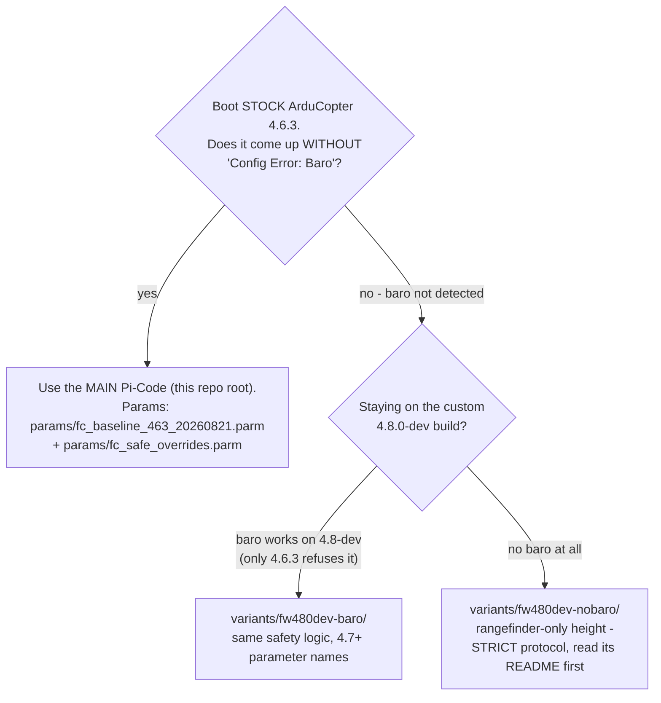

# Firmware variants — which folder do I run?

The companion code exists in three flavours because the flight controller's state
decides which firmware (and therefore which **parameter names** and which **EKF height
source**) is available. Pick by the decision tree, then follow that folder's README.

| | Firmware | Barometer | EKF height source | Risk level |
|---|---|---|---|---|
| **Main Pi-Code** (repo root) | stock 4.6.3 | working | Baro (`EK3_SRC1_POSZ=1`) | the intended configuration |
| `fw480dev-baro/` | custom 4.8.0-dev | working | Baro (`EK3_SRC1_POSZ=1`) | dev firmware, otherwise identical logic |
| `fw480dev-nobaro/` | custom 4.8.0-dev (baro check bypassed) | dead / absent | Rangefinder (`EK3_SRC1_POSZ=2`) — **forced, this is the crash configuration** | fly only under the strict protocol in its README |

Hard rules, all three flavours:

- **Never mix parameter files across folders.** The 4.6.3 files use `RNGFND1_MIN_CM`
  (cm) / `RTL_ALT` (cm); the 4.8 files use `RNGFND1_MIN` (m) / `RTL_ALT_M` (m).
  ArduPilot silently ignores names it does not know — loading the wrong file *looks*
  successful and leaves the sensor or RTL altitude misconfigured.
- Every variant's `drone.log_autopilot_version()` warns when the FC's firmware does not
  match the folder you are running — take that warning seriously, it exists because of
  exactly this trap.
- After any `param load`: reboot, then verify the critical values with
  `python setparam.py --show ...` (each variant README lists the exact command).
- The dataflash logs and the incident analysis live with the main repo
  (`docs/SIM_TO_REAL.md` §5c); the variants inherit all its lessons.
